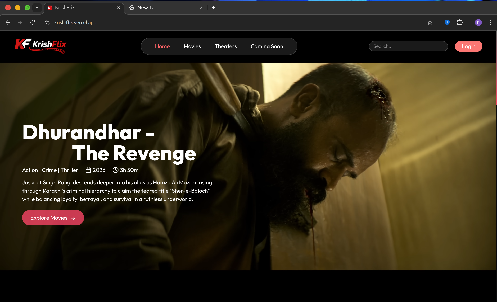
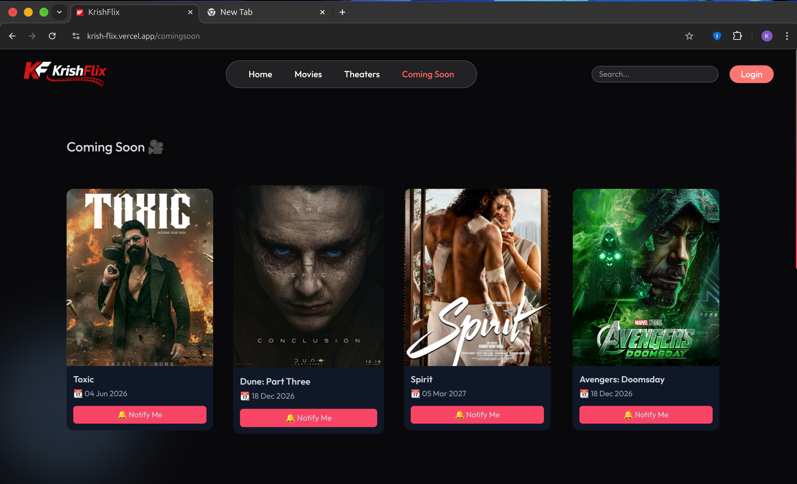
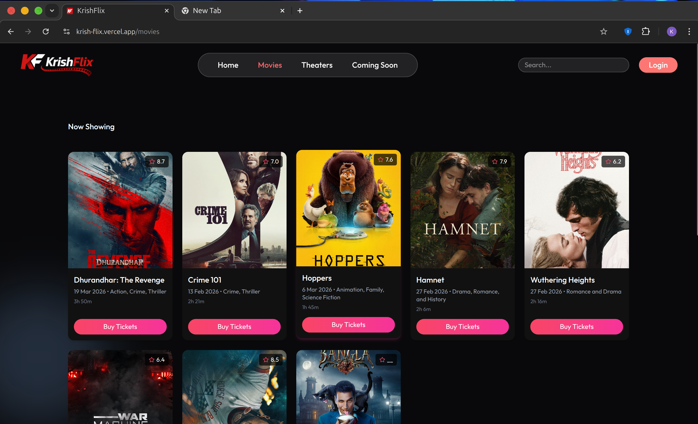
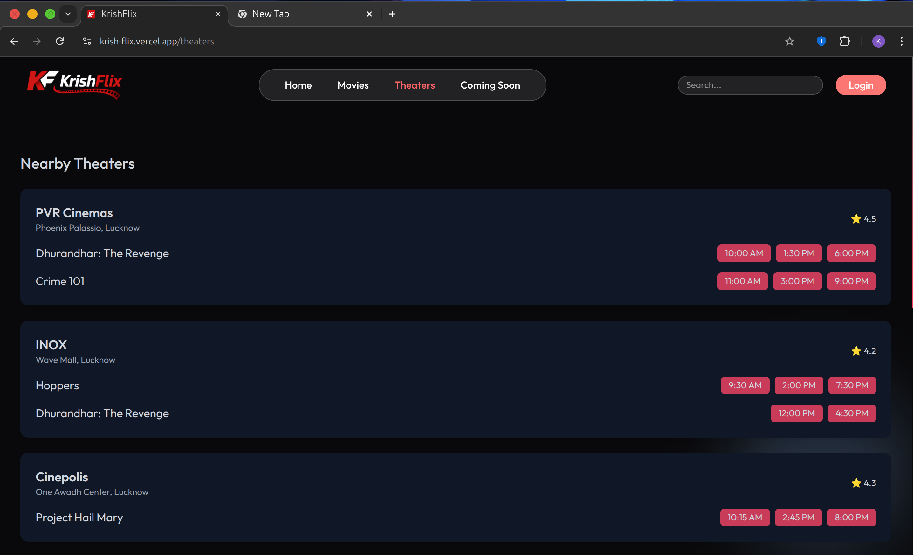
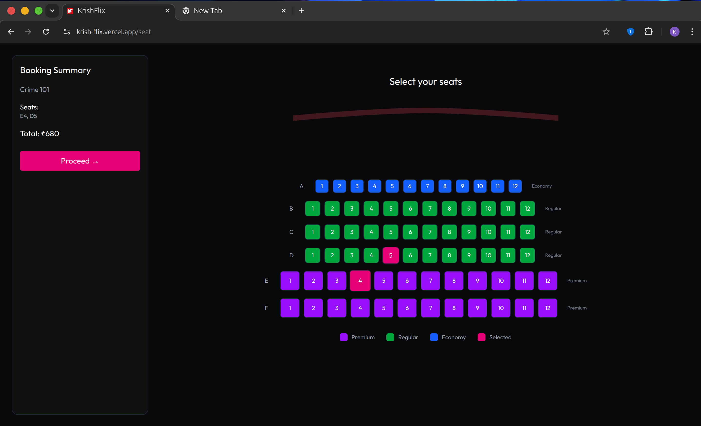

<!-- 🔥 TOP BANNER -->

<p align="center">
  
</p>

<h1 align="center">🎬 KrishFlix</h1>

<p align="center">
  <b>Modern Movie Ticket Booking Platform</b><br/>
  <i>Fast ⚡ • Smooth UX 🎯 • Cinematic UI 🍿</i>
</p>

<p align="center">
  <a href="https://krish-flix.vercel.app">
    
  </a>
</p>

<p align="center">
  
  
  
  
</p>

---

## 🧠 Concept

KrishFlix is built to deliver a **real-world movie booking experience** similar to platforms like BookMyShow.

It focuses on:

* ⚡ Performance
* 🎯 Smooth user experience
* 🎨 Clean & modern UI
* 📱 Fully responsive design

---

## ✨ Features

* 🎥 Cinematic home with trailer preview
* 🍿 Browse movies with ratings & details
* 📄 Movie details + embedded trailer
* 🏢 Theater & showtime selection
* 🎟️ Interactive seat booking UI (🔥 highlight)
* 🔍 Smart search
* ⏳ Coming soon section

---

## 🎟️ Booking Flow

```bash id="flow-final"
Home → Movies → Details → Theater → Seats → Payment
```

---

## ⚙️ Tech Stack

```bash id="stack-final"
Frontend   → React.js (Vite)
Styling    → Tailwind CSS
UI/UX      → Swiper.js
Deployment → Vercel
```

---

## 🚀 Getting Started

```bash id="setup-final"
git clone https://github.com/Krishnadks/KrishFlix.git
cd KrishFlix
npm install
npm run dev
```

---

## 📍 Roadmap

* [x] Homepage UI
* [x] Movies & details pages
* [x] Theater & showtime UI
* [x] Seat selection system
* [ ] Backend integration
* [ ] Payment system 💳
* [ ] Authentication 🔐
* [ ] Real-time seat locking

---


## 🎬 Visual Experience

<p align="center">
  
  <br/><br/>
  
  <br/><br/>
  
  <br/><br/>
  
  <br/><br/>
  
</p>


## 💡 Philosophy

> Simplicity is the ultimate sophistication.

KrishFlix is designed to provide a **clean, distraction-free, and smooth booking experience**.

---

## 👨‍💻 Author

**Krishna Kumar**

* GitHub → https://github.com/Krishnadks

---

## ⭐ Support

If you like this project:

👉 Give it a ⭐
👉 Share with others
👉 Contribute 🚀

---

<p align="center">
  Made with ❤️ by Krishna
</p>

<!-- 🔻 BOTTOM WAVE -->

<p align="center">
  
</p>
